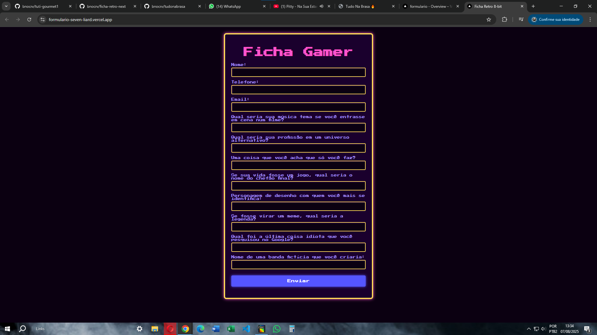

# 🎮 Formulário Gamer

*Ficha Retro Next* é um formulário interativo com estilo retrô 8 bits, criado com Next.js e integrado ao Firebase Firestore para armazenar os dados dos usuários. O projeto também responde com mensagens aleatórias após o envio, tornando a experiência mais divertida.

Você pode conferir o projeto funcionando aqui: [https://formulario-seven-liard.vercel.app](https://formulario-seven-liard.vercel.app)

---

  
  
  
  
  
  

---

# 📋 Funcionalidades principais

- Formulário interativo com estilo retrô 8 bits  
- Validação básica dos campos do formulário  
- Integração com Firebase Firestore para armazenamento dos dados  
- Resposta dinâmica com mensagens aleatórias após o envio  
- Layout simples, responsivo e acessível  

---

# 📷 Screenshot

---

# 🗂️ Estrutura do projeto

ficha-retro-next/
├── public/ # Arquivos estáticos (imagens, fontes)
├── src/
│ ├── app/ # Componentes e páginas do Next.js
│ ├── styles/ # Arquivos CSS / SCSS
│ └── firebaseConfig.js # Configuração do Firebase
├── .gitignore
├── jsconfig.json
├── next.config.mjs
├── package.json
├── package-lock.json
└── README.md

---

# 🚀 O que aprendi

- Configurar e conectar um projeto Next.js com Firebase  
- Criar formulários controlados com React  
- Enviar e armazenar dados no Firestore  
- Gerar respostas dinâmicas no frontend baseadas em dados do usuário  
- Noções básicas de UX com feedback visual e mensagens personalizadas  

---

# 👨‍💻 Sobre

Esse projeto foi meu primeiro contato prático com backend usando Firebase, aplicado em um formulário divertido e temático para aprender tecnologias modernas como Next.js e Firebase na prática.

---

# 📫 Contato

Fique à vontade para entrar em contato, trocar ideias ou dar feedback!

- GitHub: [@bnocrv](https://github.com/bnocrv)  
- LinkedIn: [@bnocrv](https://linkedin.com/in/bnocrv)  
